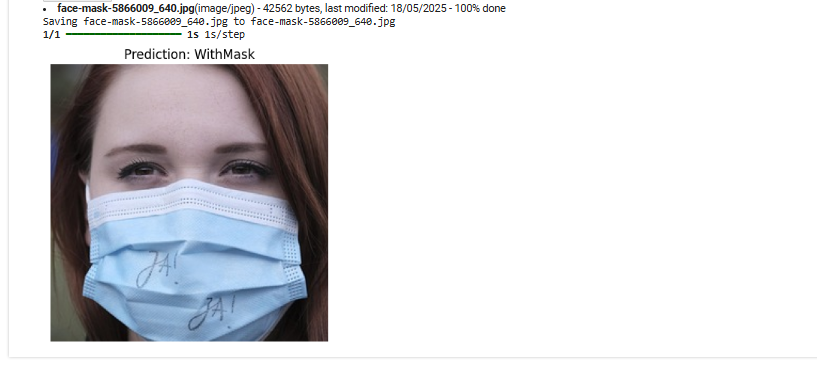

# Face Mask Detection using Deep Learning

## Overview
This project presents a deep learning-based face mask detection system that classifies whether a person is wearing a face mask or not.

The model is built using transfer learning with MobileNetV2 and achieves a test accuracy of 98.69%. The system also integrates face detection using OpenCV to enable real-world image-based inference.

---

## Problem Statement
During the COVID-19 pandemic, monitoring mask compliance became important for public safety. Manual monitoring is inefficient and difficult to scale.

This project aims to:
- Automatically detect faces in images
- Classify each detected face as:
  - WithMask
  - WithoutMask

---

## Dataset
- Total images: ~12,000
- Classes:
  - WithMask
  - WithoutMask
- Balanced dataset

### Data Split
- Training: 10,000 images (5,000 per class)
- Validation: 800 images (400 per class)
- Test: 992 images

### Preprocessing
- Images resized to 224 × 224
- Pixel values normalized (rescale = 1./255)
- ImageDataGenerator used
- No data augmentation applied


---

## Model Architecture

### Base Model
- MobileNetV2 (pre-trained on ImageNet)
- include_top = False
- Base model frozen (no fine-tuning)

### Custom Classification Head
- GlobalAveragePooling2D
- Dropout (0.3)
- Dense layer (1 neuron, sigmoid activation)

### Training Configuration
- Optimizer: Adam (learning rate = 0.0001)
- Loss: Binary Crossentropy
- Batch size: 32
- Epochs: 5

---

## Training Performance

The model showed consistent improvement across epochs with no significant overfitting.


---

## Evaluation

### Test Accuracy
- 98.69%

### Confusion Matrix


### Results Summary
- WithMask correctly classified: 481 / 483
- WithoutMask correctly classified: 498 / 509
- Total misclassifications: 13 / 992

### Classification Report
- Precision, recall, and F1-score all ≥ 0.98 for both classes
- Balanced performance across classes
- No evidence of class bias

---

## Inference Pipeline

The system supports manual image testing using a face detection + classification pipeline:

- Upload image
- Detect face using OpenCV Haar Cascade
- Crop detected face
- Resize to 224 × 224
- Normalize pixel values
- Predict mask status

### Example Outputs



### Edge Case Handling
- If no face is detected, the system returns a message instead of predicting

---

## Tools and Technologies
- Python
- TensorFlow / Keras
- OpenCV
- NumPy
- Matplotlib
- Seaborn
- Scikit-learn
- Google Colab

---

## Project Structure

```
face-mask-detection/
│
├── notebooks/
│ └── training.ipynb
│
├── models/
│ └── face_mask_detection_model.h5
│
├── src/
│ └── predict.py
│
├── images/
│ ├── dataset_distribution.png
│ ├── model_accuracy.png
│ ├── model_loss.png
│ ├── confusion_matrix.png
│ └── predictions.png
│
├── requirements.txt
├── README.md
└── .gitignore
```

## Notebooks

- 01_training.ipynb  
  Contains data preprocessing, model training, and evaluation.

- 02_inference.ipynb  
  Demonstrates face detection and mask prediction on uploaded images.


## Installation

### Clone Repository
```
git clone https://github.com/Haadii-dev/Face-Mask-Detection-using-Deep-Learning
```
```
cd face-mask-detection
```
### Install Dependencies
```
pip install -r requirements.txt
```

---

## Usage

Run the prediction script:
```
python src/predict.py
```

---

## Challenges Encountered

- TensorFlow and Streamlit dependency conflicts during deployment
- Lack of administrative access prevented installation of required system libraries
- Environment conflicts with Anaconda
- Initial evaluation issue due to shuffled test generator causing label mismatch (resolved by disabling shuffle)

---

## Limitations

- No data augmentation used during training
- No fine-tuning of the pre-trained MobileNetV2 layers
- Model evaluated on static images, not real-time video
- Cannot explicitly detect incorrectly worn masks
- Performance may drop in:
  - low lighting conditions
  - occluded or partially visible faces
  - extreme face angles
- Face detection may fail on blurry or distant images

---

## Future Improvements

- Apply data augmentation to improve generalization
- Fine-tune deeper layers of MobileNetV2
- Implement real-time video-based detection
- Support multiple face detection
- Deploy using Docker to avoid environment conflicts
- Build a web-based interface using Streamlit or Flask

---

## Conclusion

This project demonstrates the effectiveness of transfer learning for image classification tasks. Using a lightweight architecture such as MobileNetV2, the model achieves high accuracy while remaining efficient.

The system shows strong potential for real-world applications in controlled environments and can be extended into a fully deployed solution with further engineering improvements.
## Author

**M.Hammad Ullah**
* **LinkedIn:** [Click Here](www.linkedin.com/in/hammad-ullaah)
